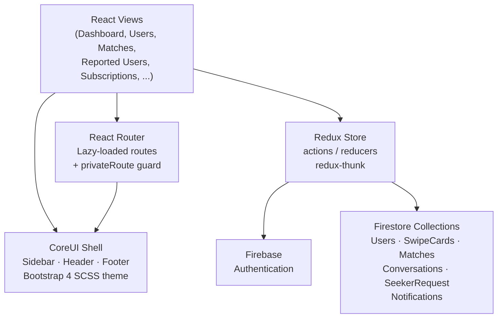

<p align="center">
  
</p>

<p align="center">
  
  
  
  
</p>

> **Developed by [Arslan Malik](https://github.com/arsalanmaalik461)**
> 📱 WhatsApp: [+92 300 8987448](https://wa.me/923008987448) · 🌐 Website: [arslanmalik.tech](https://arslanmalik.tech)

---

## 🌟 Executive Overview

**Dating App Admin Panel** is a web-based administration dashboard for managing a dating app's backend data, built on **React 17 + CoreUI 3 (Bootstrap 4)** with **Firebase** as the live data layer. Admins sign in through Firebase authentication, then work from a responsive sidebar layout that covers every operational surface of a dating product: registered users, swipe activity, matches, subscriptions, reported accounts awaiting moderation, and seeker requests.

State is managed with **Redux + thunk**, routing is lazy-loaded per module, and every view reads and writes the same Firestore collections the mobile app uses — `Users`, `SwipeCards`, `Matches`, `Conversations`, `SeekerRequest`, `Notifications` — so moderation decisions take effect immediately. A chart-powered dashboard (`Chart.js`) gives a quick visual pulse on activity. The repo ships with the full CoreUI admin template scaffolding (charts, widgets, pages, SCSS theming) customized into a dating-app operations console.

---

## 📑 Table of Contents

- [✨ Key Features & Highlights](#-key-features--highlights)
- [🖥️ Feature Showcase](#️-feature-showcase)
- [🏗️ System Architecture](#️-system-architecture)
- [🚀 Quickstart & Installation Guide](#-quickstart--installation-guide)
- [📂 Project Structure](#-project-structure)
- [🛡️ Security & Notes](#️-security--notes)

---

## ✨ Key Features & Highlights

| Feature | Description |
| :--- | :--- |
| 👥 Users Management | Browse all registered users with a dedicated user-detail page per account. |
| 🔄 Swiped Users | Inspect swipe-card activity from the `SwipeCards` Firestore collection. |
| 💘 Match Users | Review formed matches between users (`Matches` collection). |
| 💳 Subscription Users | Track which users hold paid subscriptions. |
| 🚩 Reported Users | Moderation queue for reported accounts — review and act. |
| 🔍 Seeker Requests | Manage incoming seeker/connection requests. |
| 📊 Analytics Dashboard | Chart.js-powered charts and summary widgets for app activity. |
| 🔐 Firebase Auth | Login and register pages backed by Firebase Authentication. |
| 🛡️ Private Routes | Route guard so only signed-in admins reach the console. |
| 🗄️ Redux State | Centralized store with actions, reducers, and thunk async flows. |
| 🧭 CoreUI Shell | Responsive sidebar + header + footer layout from CoreUI for React. |
| 🎨 Themed SCSS | Custom variables and overrides (`_custom.scss`, `_variables.scss`) on the CoreUI theme. |
| ⚡ Lazy-Loaded Views | Each route code-splits, so the initial bundle stays lean. |

---

## 🖥️ Feature Showcase

### 1. User Management & Moderation

> Full visibility into every account, plus a moderation queue for trouble.

- Users list with drill-down to a per-user detail page and profile view
- **Reported Users** view surfaces flagged accounts for review
- All reads/writes hit Firestore directly, so actions apply instantly to the live app

### 2. Matchmaking Oversight

> Watch the dating engine's output: swipes, matches, and requests.

- **Swiped Users** shows swipe-card activity (`SwipeCards`)
- **Match Users** lists confirmed matches (`Matches`)
- **Seeker Requests** manages pending seeker/connection requests (`SeekerRequest`)

### 3. Dashboard Analytics

> A visual pulse on the app's health.

- Chart.js bar and line charts plus CoreUI summary widgets
- Template scaffolding includes charts and widgets galleries for building more

### 4. Auth & Access Control

> The console is gated from the first screen.

- Login and register pages backed by Firebase Authentication
- `privateRoute` wrapper redirects unauthenticated visitors to login
- Redux `authReducer` holds the session state across the app

---

## 🏗️ System Architecture



---

## 🚀 Quickstart & Installation Guide

### Prerequisites

- Node.js (LTS) and npm
- A Firebase project with Authentication and Firestore enabled

### Step-by-Step Installation

```bash
# 1. Clone the repo
git clone https://github.com/arsalanmaalik461/dating-app-admin-panel.git
cd dating-app-admin-panel

# 2. Install dependencies
npm install

# 3. Point the app at your Firebase project
#    Update src/firebase/firebase.js with your project's config
#    (apiKey, authDomain, projectId, ...)

# 4. Run the dev server
npm start
# → opens http://localhost:3000

# 5. Build for production
npm run build
```

---

## 📂 Project Structure

```
dating-app-admin-panel/
├── public/                   # Static assets (index.html, manifest, avatars, favicon)
├── src/
│   ├── App.js / index.js     # App entry, store wiring
│   ├── Home.js               # Landing/home view
│   ├── routes.js             # Lazy-loaded route map (dashboard, users, matches, ...)
│   ├── privateRoute.js       # Auth guard for protected routes
│   ├── actions/              # Redux actions + action types
│   ├── reducers/             # authReducer, rootReducer
│   ├── store/                # Redux store configuration
│   ├── firebase/             # Firebase init + Firestore collection names
│   ├── containers/           # CoreUI shell: sidebar, header, footer, nav, layout
│   ├── views/
│   │   ├── dashboard/        # Analytics dashboard
│   │   ├── users/            # Users list, user detail, profile
│   │   ├── matches/          # Match users
│   │   ├── swiped_users/     # Swipe activity
│   │   ├── subscriptions/    # Subscription users
│   │   ├── reported_users/   # Moderation queue
│   │   ├── seekers/          # Seeker requests
│   │   ├── charts/           # Chart.js examples
│   │   ├── widgets/          # CoreUI widget gallery
│   │   └── pages/            # Login, register, 404, 500
│   ├── reusable/             # Shared components (image component, ...)
│   ├── utilits/              # General data helpers
│   ├── assets/               # CoreUI icons & logos
│   └── scss/                 # Theme variables and custom styles
├── package.json              # React 17 + CoreUI 3 + Firebase dependencies
└── README.md
```

---

## 🛡️ Security & Notes

- This console reads and writes live user data — **restrict Firestore access with security rules** so only admin accounts can read/write these collections.
- Client-side `privateRoute` is a UX guard, not a security boundary; enforce roles in Firebase (custom claims or rules).
- Never commit real Firebase credentials — keep them in environment config; the shipped `.env` is a placeholder.
- Reported-user moderation actions are immediate in Firestore — consider an audit trail for who actioned what.
- The panel targets desktop admins; verify the responsive layout if used on tablets/phones.

---

<p align="center">
  <sub>Developed with ❤️ by <a href="https://github.com/arsalanmaalik461">Arslan Malik</a> · 📱 <a href="https://wa.me/923008987448">WhatsApp: +92 300 8987448</a> · 🌐 <a href="https://arslanmalik.tech">arslanmalik.tech</a></sub>
</p>
